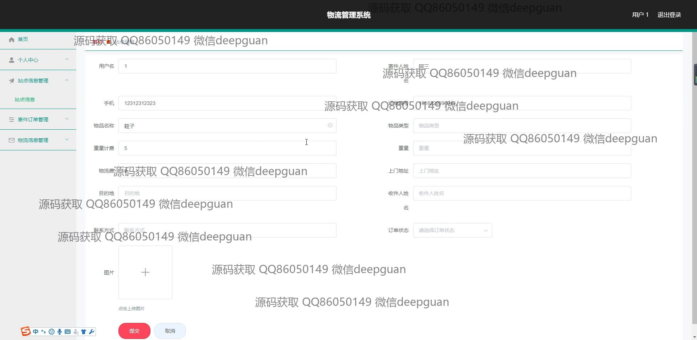

<h1 align="center">物流管理系统+vue</h1>

## 简介
物流管理系统：角色分为管理员、用户；功能涵盖订单管理、物流信息管理、配送信息管理、仓库管理、用户和配送员管理，支持订单处理、支付及结算功能，多模块协作提升物流效率。    --计算机毕业设计源码；毕设源码；java毕业设计源码

## 联系方式

<h3 align="center">获取完整代码与数据库文件 + 微信：deepguan QQ: 86050149 QQ群: 783742310</h3>

<h3 align="center">可帮忙远程部署 包运行成功！提供远程部署、修改代码、设计文档指导、代码讲解等服务！</h3>

## 功能介绍（完整见运行截图）
管理员：基本功能包括用户注册与登录管理、权限设置以及系统整体配置。管理员可管理用户信息、配送员信息、站点信息、订单、物流和仓库等模块，提供查询、编辑、删除等操作。此外，还负责查看和处理财务结算及配送员报销管理，通过分析数据有效监控系统运行状况，确保信息的准确与安全。

用户：可通过系统进行注册与登录，访问个人中心查看和修改个人信息。用户能够管理及查询自己的订单信息，包括下单、付款及跟踪物流状态。系统允许用户选择支付方式并处理结算事宜。用户还可使用系统中的资源查看收件详情、配送员信息及仓库库存，实现高效便捷的物流信息管理。

## 运行截图

本代码来源于网络,仅供学习参考使用!

